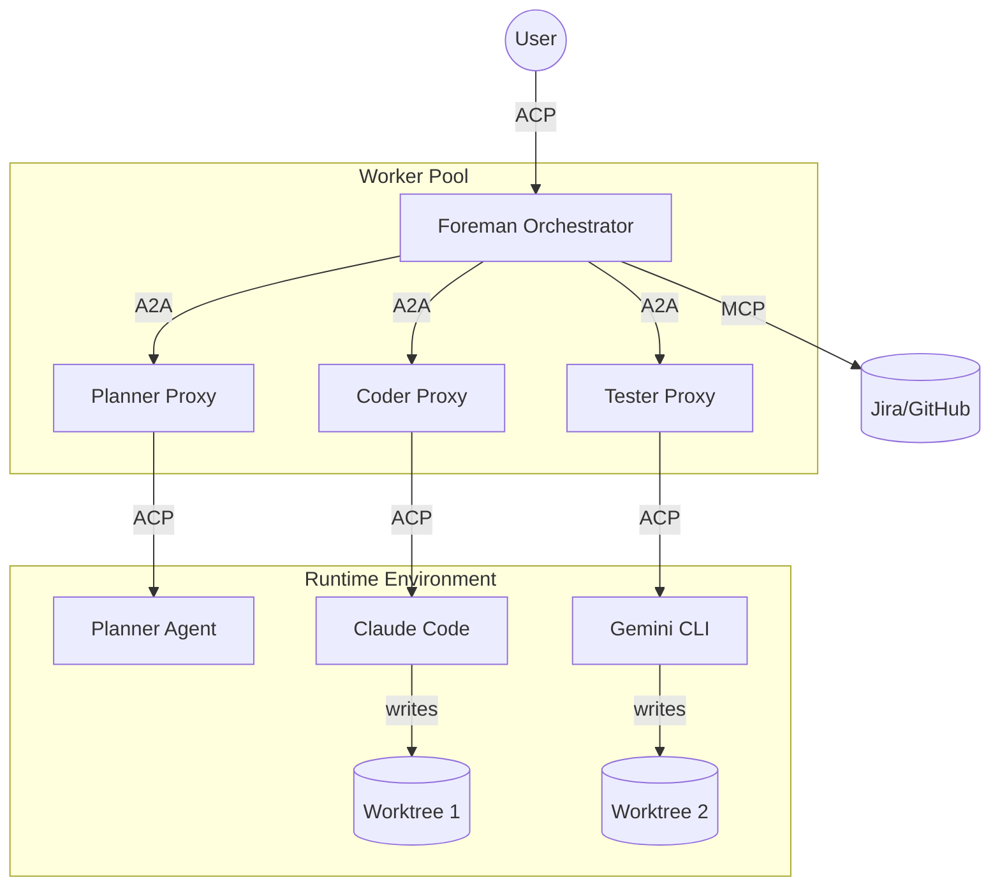

# Architecture overview

Foreman Stack is an orchestration layer for multi-agent systems, designed to enable parallel and isolated execution of complex tasks using existing coding agents. This document provides a detailed breakdown of the architectural principles, component roles, and data flows that govern the system.

## The problem: single-session bottlenecks

Modern coding agents like Claude Code or Gemini CLI are useful but are generally limited to a single conversation context. When a project requires parallel work across multiple specialized roles—such as simultaneous refactoring, test writing, and documentation updates—a single agent becomes a bottleneck.

Foreman Stack solves this by introducing a hierarchical orchestration layer that can manage multiple specialized agents in parallel, providing each with its own isolated environment (Git worktree).

## Core architectural principles

### 1. Protocol bridging (ACP ↔ A2A)
The system leverages two primary protocols:
- **Agent Client Protocol (ACP)**: An open standard for communication between AI agents and their clients (typically IDEs). It uses JSON-RPC over stdio.
- **Agent-to-Agent (A2A) Protocol**: A protocol designed for agents to collaborate with each other. It uses JSON-RPC over HTTP/SSE.

Foreman acts as a bridge: it presents itself as an ACP agent to the user, but acts as an A2A client to its pool of workers.

### 2. Worktree isolation
Concurrency in code generation is dangerous without isolation. Foreman Stack ensures that every task dispatched to a worker runs in a dedicated **Git worktree**. This prevents workers from overwriting each other's changes or interfering with the user's active development.

### 3. Plan-owner-first routing
When a worker needs guidance or permission, the request is routed to the entity that understands the task's context best: the **Plan Owner** (the Planner agent). This minimizes user interruptions and ensures tactical decisions are consistent with the overall goal.

---

## Component roles

### Foreman (The Orchestrator)
The Foreman is the "brain" of the operation. It is a standalone process with its own LLM loop.

**The Two Hemispheres of the Foreman:**
- **Router/Dialog Hemisphere**: Manages the ACP session with the user, maintains conversation history, and decides whether a user request requires planning or can be handled as a direct dialog.
- **Plan Executor Hemisphere**: Orchestrates the execution of a plan, dispatches tasks to workers via A2A, tracks statuses, and synthesizes the final results.

### Proxy (The Adapter)
The Proxy is a lightweight protocol adapter. It wraps a standard ACP-compliant agent (the Worker) and exposes it as an A2A server. It manages the lifecycle of the worker subprocess and provides the necessary filesystem isolation.

### Worker (The Executor)
A Worker is any ACP-compatible agent (e.g., Claude Code, Codex). It receives prescriptive subtasks from the Proxy and performs the actual work (writing code, running tests).

### Planner (The Plan Owner)
The Planner is a specialized worker role (skill: `task_decomposition`). It takes a high-level goal and generates a structured **Plan** consisting of:
- **Batches**: Groups of subtasks that can be executed in parallel.
- **Subtasks**: Individual units of work with assigned agents, descriptions, and expected outputs.

The Planner remains active as a **stateful plan owner** to resolve ambiguities during the execution phase.

---

## Data flow and lifecycle

### 1. Intent discovery and planning
When a user sends a prompt to the Foreman, the Foreman's LLM loop determines if the task is complex. If so, it dispatches the goal to a **Planner**. The Planner returns a structured JSON plan.

### 2. Batch execution
The Foreman iterates through the plan's batches sequentially. For each batch, it dispatches all subtasks in parallel to the assigned workers.

### 3. Isolated implementation
The Proxy for each worker:
1. Receives the task.
2. Creates a new Git branch and worktree.
3. Starts the ACP agent subprocess.
4. Injects the task description and originator intent as the initial prompt.

### 4. Permission and escalation flow
If a worker requests a sensitive action (e.g., `terminal/create` for an unwhitelisted command):
1. The Worker (via ACP) asks the Proxy for permission.
2. The Proxy (via A2A) escalates the request as `input-required` to the Foreman.
3. The Foreman routes the request to the **Plan Owner** (the Planner).
4. The Planner either resolves the request (e.g., "Yes, this is required for the refactoring") or asks the Foreman to escalate to the **User**.

### 5. Completion and synthesis
Once all batches are finished, the Foreman collects the summaries from all subtasks and performs a final LLM call to synthesize a comprehensive report for the user, including links to the generated branches.

---

## Component interaction diagram

## Security and isolation model

Foreman Stack implements a layered security model:

- **Filesystem Isolation**: Git worktrees ensure no "hidden" changes to the main repository.
- **Network Isolation**: Proxies bind to loopback addresses by default, preventing unauthorized remote access.
- **Permission Layering**: Auto-approval for safe operations (reads, worktree-local writes) and mandatory escalation for sensitive actions.
- **Credential Separation**: Injected MCPs allow the Foreman to provide scoped tools to workers without sharing its own primary credentials (e.g., the worker gets a token for one repository, while the Foreman has access to the whole organization).
